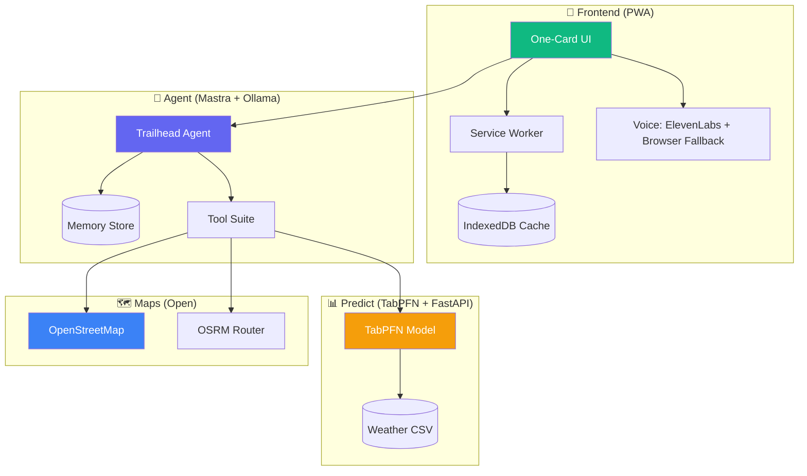

# 🌲 Trailhead

**An offline-first outdoor companion powered by open-source AI.**

Open it for 30 seconds. It tells you the best outing for today — a walk, birding spot, gardening task, foliage run, or photo op. It reads it aloud. You put the phone away.

> Built for the [DEV Hacktoberfest "Touch Grass" Challenge](https://dev.to/challenges/hf26) — Week 1

---

## Architecture



## Tech Stack

| Layer | Technology | Why |
|---|---|---|
| Frontend | React + Vite + TypeScript + Tailwind | PWA, mobile-first, offline-capable |
| Agent | [Mastra](https://mastra.ai) + Ollama | Open-source agent framework + local model |
| LLM | Gemma (via Ollama) | Open-weight, runs locally, swappable |
| Prediction | [TabPFN](https://priorlabs.ai) + FastAPI | Tabular foundation model for weather forecasting |
| Maps | OpenStreetMap + OSRM | Open data, open routing |
| Voice | ElevenLabs + browser SpeechSynthesis | Premium TTS online, works offline |
| Observability | Sentry | Agent tracing, latency, cost tracking |

## Quick Start

```bash
# 1. Clone
git clone https://github.com/YOUR_USER/trailhead.git
cd trailhead

# 2. Copy environment config
cp .env.example .env

# 3. Install & pull model
ollama pull gemma3:4b

# 4. Start all services
docker compose up

# 5. Open
open http://localhost:5173
```

### Without Docker

```bash
# TabPFN prediction service
cd predict && pip install -r requirements.txt
uvicorn app.main:app --port 8001 --reload

# Agent server
cd agent && npm install && npm run dev

# Frontend
cd web && npm install && npm run dev
```

## Swap the Model

Change one env var:

```bash
# In .env
MODEL_NAME=gemma3:12b   # or: gemma3:27b, llama3.2:3b, phi4-mini

# Pull and restart
ollama pull gemma3:12b
docker compose restart agent
```

## Run Fully Offline

1. Pull the model once while online: `ollama pull gemma3:4b`
2. Open the app once to cache the PWA assets
3. Done — the app works with no internet:
   - Ollama runs the model locally
   - TabPFN uses cached weather data
   - Voice falls back to browser SpeechSynthesis
   - Route and checklist are cached in IndexedDB

## Project Structure

```
trailhead/
├── web/        # React PWA (mobile-first, offline-capable)
├── agent/      # Mastra agent (tools, memory, workflows)
├── predict/    # TabPFN FastAPI service
├── data/       # Weather CSV + fetch script
├── docs/       # Architecture, open AI notes, Sentry writeup
├── scripts/    # Benchmark, seed memory
└── docker-compose.yml
```

## License

MIT
